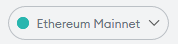
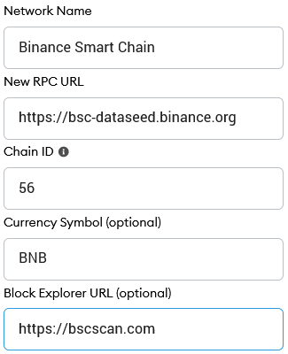
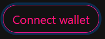
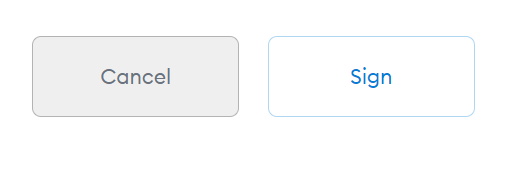

# Connect Your Wallet to OnlyNFTs

## Smartphone/Mobile




To connect MetaMask to OnlyNFTs follow the steps below.

## Android and IOS

* [ ] Make Sure you are connected to [**Binance Smart Chain**](create-a-wallet/metamask-bsc-setup.md)\*\*\*\*

1. [ ] Once you've confirmed you are connected to [**Binance Smart Chain**](create-a-wallet/metamask-bsc-setup.md)**.** Go to the burger menu and tap **Browser**.

1. Type "**OnlyNFTs Marketplace**" into the search field and start the search. The top result will be the OnlyNFTs Marketplace. Tap to enter it.
2. You wallet will ask you to connect. Tap **Connect** to connect to OnlyNFTs.



## **Desktop/Web Browser wallets**




## Chrome and Firefox

1. [ ] Open MetaMask and click on the **network selector** at the top. By default it will show "Ethereum Mainnet". Scroll down and click **Custom RPC**.

1. [ ] A window will open. Type in the details below.

**Network Name:** Binance Smart Chain  
**New RPC URL:** [https://bsc-dataseed.binance.org](https://bsc-dataseed.binance.org)  
**Chain ID:** 56  
**Currency Symbol \(optional\):** BNB  
**Block Explorer URL \(optional\):** [http://bscscan.com](http://bscscan.com)

1. [ ] Make sure you've typed everything in correctly and click **Save**. Binance Smart Chain will now be one of your network options.

1. [ ] Visit the [Onlynfts Marketplace](https://marketplace.onlynfts.online/). In the top right corner you'll see the **Connect Wallet** button. Click it.

* [ ] Click sign to **Connect/Log in**.





**Remember - NEVER, under any situation, should you ever give someone your private key or recovery phrases.**


