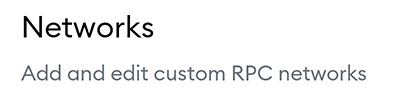
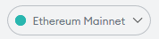

# MetaMask BSC Setup




## Android and iOS

1. [ ] Open MetaMask and tap on the **burger icon** in the top-left.

1. [ ] Tap **Settings** in the menu.

1. [ ] In the Settings menu, tap on **Network**.

1. [ ] Tap on the **Add Network** button at the bottom.

1. [ ] On the page that opens, type in the following details:

**Network Name:** Binance Smart Chain  
**RPC Url:** [https://bsc-dataseed.binance.org](https://bsc-dataseed.binance.org)  
**Chain ID:** 56  
**Symbol:** BNB  
**Block Explorer URL:** [https://bscscan.com](https://bscscan.com/)

* [ ] Click **Add.**




## Chrome and Firefox

1. [ ] Open MetaMask and click on the **network selector** at the top. By default it will show "Ethereum Mainnet". Scroll down and click **Custom RPC**.

1. [ ] A window will open. Type in the details below.

**Network Name:** Binance Smart Chain  
**New RPC URL:** [https://bsc-dataseed.binance.org](https://bsc-dataseed.binance.org)  
**Chain ID:** 56  
**Currency Symbol \(optional\):** BNB  
**Block Explorer URL \(optional\):** [https://bscscan.com](https://bscscan.com/)

1. [ ] Make sure you've typed everything in correctly and click **Save**. Binance Smart Chain will now be one of your network options.




